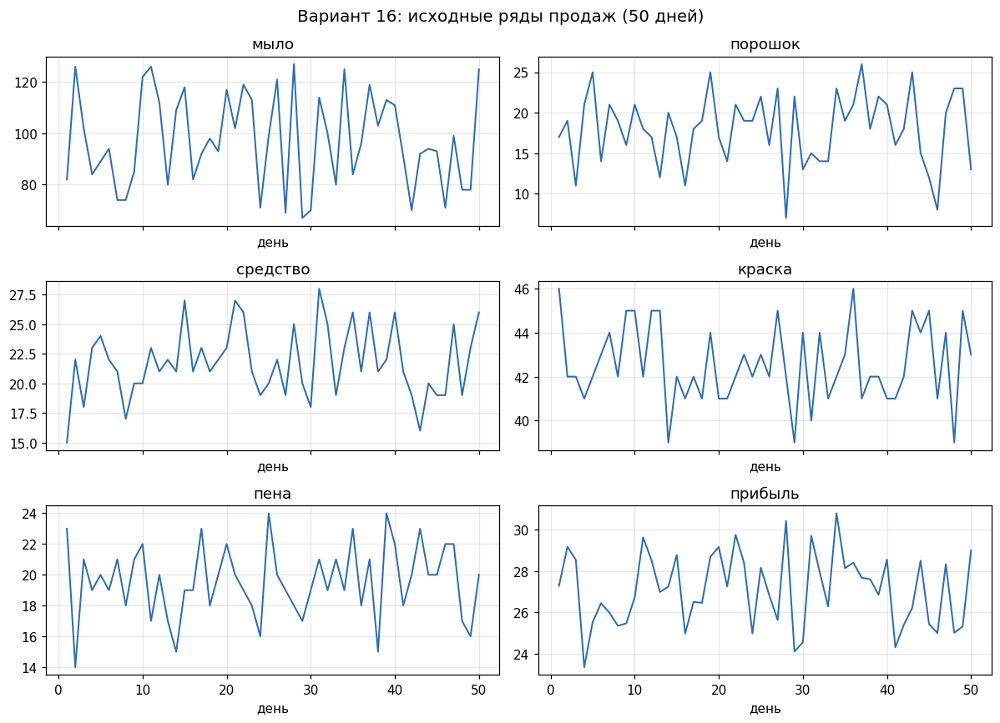
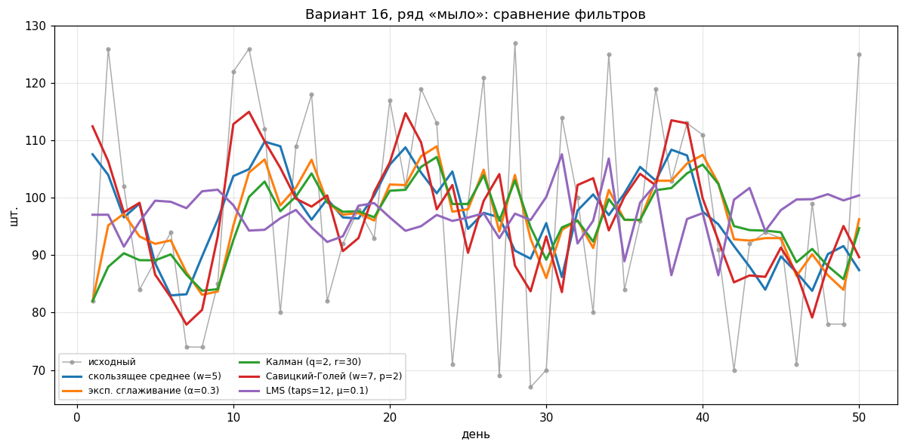
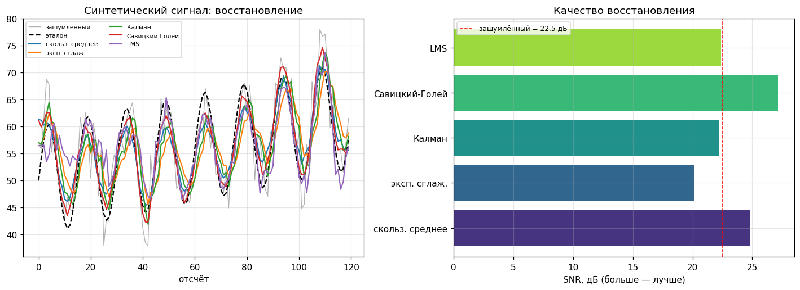
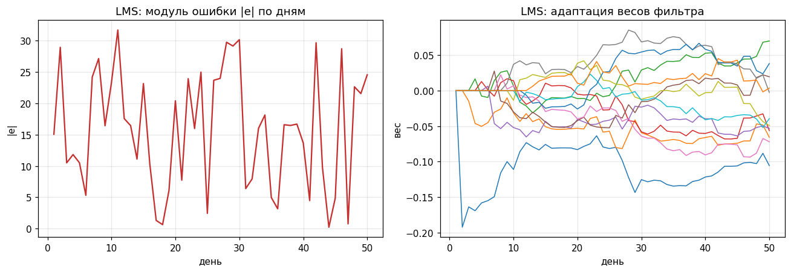
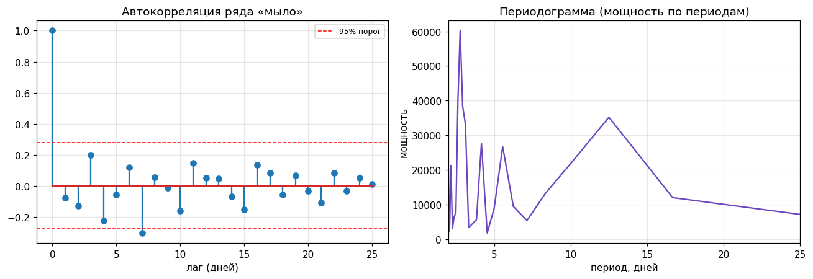
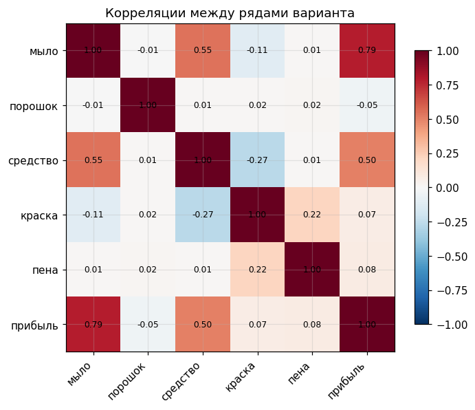
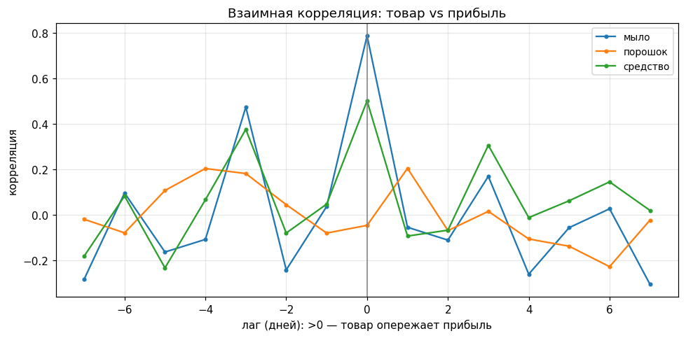

# Лабораторная 3. Временные ряды

Курс «Продвинутые методы оптимизации».

## Что сделано

Реализовал методы фильтрации временных рядов, сравнил их на данных о продажах
из `sell.csv` и проанализировал данные своего варианта.

Код вынесен в папку `src/`, эксперименты и графики — в ноутбуке, чтобы не
мешать реализацию с запуском.

- Фильтры: [`src/filters.py`](./src/filters.py)
- Анализ: [`src/analysis.py`](./src/analysis.py)
- Загрузка данных и метрики: [`src/utils.py`](./src/utils.py)
- Эксперименты и графики: [`research.ipynb`](./research.ipynb)

## Как запустить

```bash
pip install -r requirements.txt
jupyter notebook research.ipynb   # Kernel -> Restart & Run All
```

Все генераторы случайных чисел зафиксированы (`seed_everything(42)`), так что
результаты повторяются. Графики для отчёта собираются скриптом
`python gen_figures.py` (кладёт PNG в `figures/`). Тесты: `pytest -v`.

## Вариант

Вариант = (сумма цифр номера ИСУ) mod 60. Мой ИСУ 490030, сумма цифр 16, значит
**вариант 16**. Номер задаётся в начале ноутбука переменной `ISU`.

## Задача 1. Реализация фильтров

Реализовал вручную на NumPy:

| Метод | Пункт задания | Идея |
|---|---|---|
| Скользящее среднее | п.1 | усреднение в окне |
| Экспоненциальное сглаживание | п.1 | усреднение с памятью о прошлом |
| Фильтр Калмана (локальный уровень) | п.2 | оценка уровня по модели «блуждание + шум» |
| Савицкий-Голей | п.3 | полином МНК в окне, значение в центре |
| Адаптивный LMS | п.4  | FIR-фильтр, веса подстраиваются на ходу |

 Савицкого-Голея проверил
сравнением со `scipy.signal.savgol_filter` — во внутренней области совпадает.
Для LMS использовал нормированную версию и центрирование сигнала, иначе на
коротком ряду он плохо сходится.

## Задача 2. Сравнение на данных варианта

### Исходные ряды



Ряды товаров скачут вокруг среднего уровня, прибыль более гладкая.

### Сравнение фильтров на ряду «мыло»



Савицкий-Голей точнее держит пики, скользящее среднее и Калман дают гладкую
среднюю линию, LMS сглаживает сильнее всех.

### Количественное сравнение

У реальных данных нет эталона, поэтому для MSE и SNR сделал тест на синтетике
(тренд + синусоида + шум):



| Метод | MSE | SNR, дБ |
|---|---|---|
| зашумлённый | 17.76 | 22.54 |
| скользящее среднее | 10.47 | 24.84 |
| эксп. сглаживание | 30.63 | 20.17 |
| Калман | 19.23 | 22.19 |
| Савицкий-Голей | **6.13** | **27.16** |
| LMS | 18.32 | 22.40 |

Лучший по SNR — Савицкий-Голей. На реальном ряду сравнивал по гладкости и
разбросу остатка (таблица в ноутбуке).

### Сходимость LMS



Веса выходят на стабильный режим за первые 10–15 дней.

## Задача 3. Анализ данных

### Периодичность



Автокорреляция почти не выходит за порог значимости, в спектре нет одного явного
пика. Значит выраженной периодичности у ряда нет, он близок к шуму вокруг
среднего уровня.

### Корреляции



Прибыль сильнее всего связана с продажами мыла (0.79) и средства (0.50), с
остальными товарами связи почти нет.



Максимум взаимной корреляции «товар — прибыль» на нулевом лаге — продажи и
прибыль меняются в один день, без опережения.

## Выводы

1. Лучший фильтр по точности — Савицкий-Голей (минимальный MSE, сохраняет форму
   пиков). Скользящее среднее — простой надёжный вариант.
2. Калман хорош, когда уровень меняется плавно; на периодике слегка запаздывает.
   Экспоненциальное сглаживание смотрит только в прошлое, поэтому отстаёт по фазе.
3. LMS даёт самый гладкий результат и подстраивается под данные, но требует
   времени на сходимость и подбора скорости обучения.
4. Ряды товаров близки к шуму вокруг постоянного уровня, чёткого периода нет.
   Прибыль более гладкая и сильно коррелирует с продажами мыла и средства.
